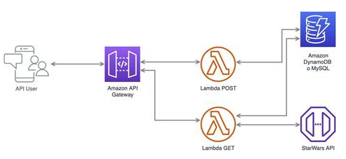

# Descripción del reto técnico:

1. Crear una API en Node.js con el framework Serverless para un despliegue en AWS.
2. Adaptar y transformar los modelos de la API de prueba. Se tienen que mapear todos los nombres de atributos modelos del inglés al español (Ej: name -> nombre).
3. Integrar la API de prueba StarWars API (líneas abajo está el link) se deben integrar uno o más endpoints.
4. Crear un modelo de su elección mediante el uso de un endpoint POST, la data se tendrá que almacenar dentro de una base de datos.
5. Crear un endpoint GET que muestre la data almacenada.

## API de prueba SWAPI:

https://swapi.py4e.com/documentation

## Puntos de evaluación:

- [x] Mínimo 2 endpoints, GET para recuperar la información y POST para crear un elemento
- [x] Integración con una base de datos (DynamoDB o MySQL)
- [x] Integración con SWAPI
- [x] Uso de Serverless Framework
- [x] Uso de Node.js
- [x] Respeto de las buenas prácticas de desarrollo
- [x] Traducción de campos de inglés a español

## Puntos bonus:

- [ ] Documentación de uso (2 puntos)
- [x] Pruebas unitarias (10 puntos)
- [ ] Documentación en Open API/Swagger (2 puntos)
- [ ] Desplegar sin errores en AWS con el comando deploy del framework serverless (2 puntos)
- [ ] Mayor complejidad de Integración (3 puntos)

## Arquitectura base:

